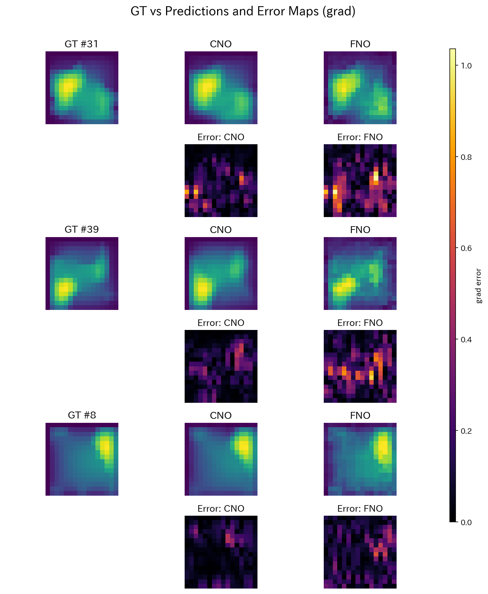
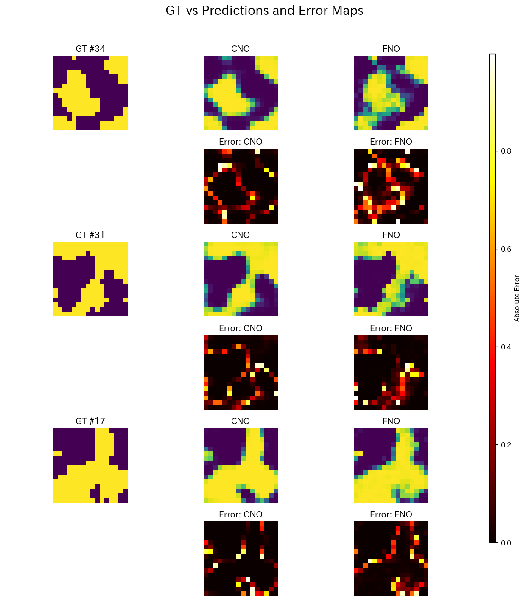
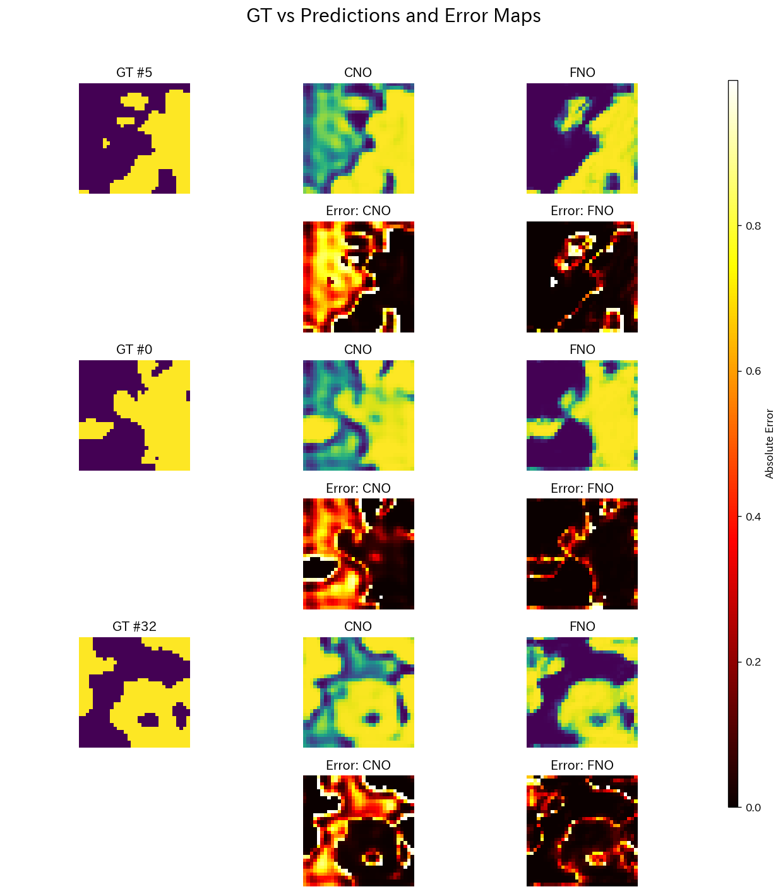

# "A Comparative Study of CNO, and FNO for Learning PDE Operators: Forward and Inverse Problem on Darcy Flow"

---

## 背景と目的

**Neural Operator（NO）** は，関数空間間の写像（すなわち作用素）を直接学習するニューラルネットワークとして注目されている．特に，偏微分方程式（PDE）における発展写像や境界条件付き解空間のモデリングにおいて，その応用可能性が広がっている．

本プロジェクトでは，NOアーキテクチャの代表例である   **Fourier Neural Operator（FNO）**  を対象として，畳み込みカーネルに基づく軽量版CNO-likeなモデル（以下、**CNO**）との比較を行う．本リポジトリで作成したCNOモデルは，格子不変性を持たず，解像度スケールに対してロバスト性が保証されないため，厳密にはNeural Operatorの定義を満足しないが，モデルのパラメータ数の極端な肥大をさけるため，今回は簡素化したモデルを採用した．  
（各モデルについては \models を参照．）

比較に用いる問題設定には，NOに関する先行研究でも頻繁に用いられる**Darcy Flow問題**を採用し，以下の2つの方向性のタスクを扱う：

- **順問題（forward problem）**：  
  - 透水係数分布（2値マップ） → 圧力場 （回帰タスク）
  - FNOにおける座標情報の有無による性能比較

- **逆問題（inverse problem）**：  
  圧力場 → 透水係数分布（2値マップ） （分類タスク）

これにより，両モデルの**解像度ロバスト性・構造的表現力・機能的役割の違い**を包括的に評価・比較する．

また，FNOでは実装上，座標情報のエンコーディングが精度に大きく寄与するとされているため，位置エンコーディングの影響を評価するために座標情報の付与の有無による精度評価を行った．

## Data License

本研究で使用する **PDEBench** データセットは、下記のライセンスで公開されています。

| 項目 | 内容 |
| --- | --- |
| データセット | PDEBench (daRUS Dataset ID 2986) |
| ライセンス | Creative Commons **CC BY 4.0** |
| 利用条件 | 出典表示（著者・タイトル・リポジトリ DOI）を行えば，商用・非商用を問わず利用・改変・再配布が可能 |
| 配布ページ | <https://darus.uni-stuttgart.de/dataset.xhtml?persistentId=doi:10.18419/darus-2986> |
| 論文 | Takamoto *et al.* “PDEBench: An Extensive Benchmark for Scientific Machine Learning”, NeurIPS Datasets & Benchmarks 2022. |

> **Note.** PDEBench のコード本体（データ生成・ベースライン実装）は  
> [pdebench/PDEBench](https://github.com/pdebench/PDEBench) リポジトリで公開されており，  
> そちらは **MIT License** です．データ部分は CC BY 4.0，コード部分は MIT という二段構成になっている点に注意してください．

---

## モデル構成

比較対象としたモデルは以下のとおりである．  
すべてのモデルは，16x16解像度の画像データ（透水係数分布と対応する圧力場）を用いて訓練を行った．  
＊各モデルの詳細はmodelのコードを参照

| Model | Summary                             | Params |
|-------|--------------------------------------|--------|
| CNO   | U-Net (depth=2, hidden=32)           | ~416K  |
| FNO   | 3-layer SpectralConv, width=48       | ~204K  |

## 主な結果
本リポジトリでは，構造的公平性よりも，各モデルの本来の設計意図に基づいて性能を評価しており，速度・精度・汎化性能などの観点から総合的に比較を行った．

### Darcy Flow 順問題

#### 評価指標の説明

本実験では，予測精度を多角的に評価するために以下の4つの指標を用いた．

- **MSE（Mean Squared Error）**：  
  ピクセルごとの誤差を二乗して平均したものであり，最も基本的な回帰タスクの損失関数として広く用いられている．値が小さいほど，予測結果が正解に近いことを示す．

- **PSNR（Peak Signal-to-Noise Ratio）**：  
  画像のダイナミックレンジとMSEに基づいて計算される指標であり，画素単位での再現精度を評価する．値が高いほど画質が良好であることを意味する．

- **SSIM（Structural Similarity Index Measure）**：  
  輝度・コントラスト・構造の3つの成分に基づいて画像の類似性を評価する指標であり，人間の視覚特性に近い評価が可能である．1に近いほど予測と正解の構造が一致していることを示す．

- **HF_MSE（High-Frequency MSE）**：  
  Sobelフィルタ等を用いて抽出した高周波成分に対してMSEを計算する指標である．画像中のエッジや局所構造の再現精度を捉えることができ，値が小さいほど細部構造が正しく復元されていることを示す．

#### 推論時間・評価指標（順問題, 16x16解像度）

| Model     | Params    | Inference Time [ms] ↓ |     MSE ↓     |   PSNR ↑   |   SSIM ↑   |  HF_MSE ↓    |
|-----------|-----------|------------------------|----------------|------------|------------|--------------|
| CNO      | ~416K     | **0.76**                   | **3.0251e-03** | **25.19**  | **0.9792** | 1.7452e-01   |
| FNO       | ~204K     | 0.91                   | 1.7926e-01     | 21.05      | 0.9455     | 4.5291e+01   |

#### 推論結果サンプル（16x16解像度）
以下は，各モデルでの圧力場の予測結果と勾配誤差マップの比較である．

#### 推論時間・評価指標（順問題, 32x32解像度）

| Model     | Params    | Inference Time [ms] ↓ |     MSE ↓     |   PSNR ↑   |   SSIM ↑   |   HF_MSE ↓   |
|-----------|-----------|------------------------|----------------|------------|------------|----------------|
| CNO      | ~416K     | **1.60**                   | 2.2586e-01     | 6.46       | 0.6209     | **1.0565e+00** |
| FNO       | ~204K     | 1.98                   | **1.7157e-01** | **19.80**  | **0.9183** | 1.7867e+02     |

#### 推論結果サンプル（32x32）
以下は，各モデルでの圧力場の予測結果と勾配誤差マップの比較である．

### FNOの座標情報の精度への影響評価
FNOは，理論的には座標情報を明示的に与えずとも解像度に依存しない学習が可能とされている．しかし，特に低解像度かつ非周期境界を含むタスクにおいては，座標情報の有無が予測性能に影響を及ぼす可能性がある．

本セクションでは，座標情報を入力に付与したFNO（WithCoords）と，付与しないFNO（NoCoords）を比較し，その影響を定量的に評価する．

#### FNO構造比較：座標情報（coord）あり vs なし（順問題, 16x16解像度）

| Model           |     MSE ↓      |   PSNR ↑   |   SSIM ↑   |  HF_MSE ↓      |
|-----------------|----------------|------------|------------|----------------|
| FNO with coord  |  1.8002e-01    | **20.96**  | **0.9432** | 4.5290e+01     |
| FNO no coord    | **1.7464e-01** | 12.49      | 0.7131     | **4.4261e+01** |

#### FNO構造比較：座標情報（coord）あり vs なし（順問題, 32x32解像度）

| Model          |     MSE ↓       |   PSNR ↑   |   SSIM ↑   |  HF_MSE ↓      |
|----------------|-----------------|------------|------------|----------------|
| FNO with coord | 1.7411e-01      | **19.47**  | **0.9122** | 1.7880e+02     |
| FNO no coord   | **1.7161e-01** | 12.54      | 0.7059     | **1.7685e+02** |

#### 推論結果サンプル
以下は，FNOにおける座標情報（位置エンコーディング）の有無が，出力画像の構造的整合性にどのような影響を与えるかを可視化したものである．  
誤差指標としてSSIM（1 - SSIM）を使用し，構造的に一致していない領域ほど明るく表示される．
特に境界付近や細部構造において，座標情報の有無による再現性の差が顕著に現れていることがわかる．

### Darcy Flow 逆問題
#### 評価指標の説明（2値分類）

本実験では，分類モデルの性能を多角的に評価するために以下の3つの指標を用いた．

- **Accuracy（正解率）**  
  全ピクセルに対して，予測ラベルと正解ラベルが一致した割合を示す最も基本的な指標である．ただし，クラスに偏りがある場合には高い値を示しても有効性に乏しいことがある．

- **IoU（Intersection over Union）**  
  予測領域と正解領域の重なり具合を評価する指標であり，その交差部分の面積を合併部分の面積で割った値として定義される．値が高いほど，予測と正解の空間的な一致度が高いことを示す．

- **Dice係数（Dice Similarity Coefficient）**  
  IoUと類似するが，予測と正解の交差面積を平均面積で割る形式で定義される．False Negative に対してやや敏感な性質を持ち，医用画像処理などで広く用いられる．1に近いほど良好な一致を示す．

#### 推論時間・評価指標（逆問題, 16x16解像度）

| Model | Params   | Inference Time [ms] ↓ | Accuracy ↑ |   IoU ↑   |  Dice ↑  |
|--------|----------|------------------------|------------|-----------|----------|
| CNO    | ~416K    | 0.79                   | 0.9417     | 0.8718    | 0.9191   |
| FNO    | ~204K    | 1.01                   | 0.9378     | 0.8604    | 0.9087   |

#### 推論結果サンプル（逆問題, 16x16解像度）

以下は、逆問題（透水係数の2値推定）における各モデルの推論結果を、正解マスク（GT）とともにランダムに抜粋した例である。  
左端がGround Truth（正解マスク）、以降に各モデルの予測マスクを並べて表示している。

各モデルの出力は連続値であるが、しきい値0.5に基づいて2値化しており、色の明暗がクラスの存在・非存在を示す。  
モデルによって予測の空間的傾向が異なることが視覚的に確認でき、特にFNOは広域構造に強く、CNOは局所性に敏感なパターンを示す傾向がある。

また、誤差マップ（予測とGTとの差分）もあわせて表示しており、各モデルの誤認識領域（False Positive / False Negative）の分布を確認することで、モデルの特性や誤差傾向を定性的に把握できる。

#### 推論時間・評価指標（逆問題, 32x32解像度）

| Model | Params   | Inference Time [ms] ↓ | Accuracy ↑ |   IoU ↑   |  Dice ↑  |
|--------|----------|------------------------|------------|-----------|----------|
| CNO    | ~416K    | 1.69                   | 0.7514     | 0.6463    | 0.7541   |
| FNO    | ~204K    | 2.09                   | **0.9234** | **0.8332**| **0.8940** |

#### 推論結果サンプル（逆問題, 32x32解像度）
以下は32x32の解像度で同様に推定した結果である．

## 考察
### 順問題について

#### 性能比較

推論速度については、**CNOが速い**結果となった。これは、FNOがフーリエ変換と複素数演算を含むため、計算コストが高いためである。

精度面では、**訓練時と同じ解像度（16×16）においては、CNOの方がFNOよりも優れていた**。特にFNOは高周波領域の誤差（HF_MSE）が顕著に大きく、**低周波成分を主に扱うSpectralConvが高周波情報を捨てる設計である**ことを反映していると考えられる。

一方で、構造的整合性を示すSSIM指標においては、**FNOは高い精度を示しており、大域構造の再構成に強みを持つことが示唆される**。これはフーリエ空間での大域的な特徴抽出に基づく、FNOの本質的な特性と一致している。

より高解像度な入力（32×32）では状況が逆転し、**FNOが圧倒的に優れた性能を発揮した**。MSE・PSNR・SSIMのすべてでFNOが最も高いスコアを示し、**解像度に対するロバスト性がFNOには構造的に備わっている**ことが定量的に裏付けられた。これに対し、**CNOでは解像度の増加に伴い性能が大幅に低下しており、これは解像度ロバスト性を明示的に持たない影響である**と考えられる。

#### 誤差分布について

本READMEでは、代表的な誤差指標として**勾配誤差マップ（高周波構造の差分）**を取り上げている。他の誤差マップ（絶対値誤差など）については、notebook内で可視化可能であり、必要に応じて参照されたい。

誤差分布の観察から、**全モデルで誤差は圧力の変動が激しい境界付近に集中する傾向が見られた**が、特に**FNOはこの傾向が顕著であり、SpectralConvの特性による高周波成分の欠落**が原因と考えられる。

しかし、解像度を32×32に上げると、**FNOではこの誤差が大きく減少する**。これは、入力が滑らかになったことで、FNOが低周波ドメインで十分な表現力を発揮し、構造を正しく再現できたためと推測される。

一方、CNOでは高解像度においても境界付近の誤差が残存し、むしろ悪化する傾向すら見られた。これは、**固定サイズの畳み込みカーネルによる局所処理が高解像度データに対して相対的に狭い視野しか持たず、学習済みの作用素が解像度スケールに対して一般化できなかった**ことを意味している。

### FNOの座標情報について

#### 性能評価

FNOにおける座標情報の付与は，精度向上において極めて重要であることが確認された．  
推論時間については，座標情報の有無による差はわずかであり，計算コストの観点からも大きな負担にはならない．  
このような結果から，FNOを高精度に運用する上で**座標情報の付与は事実上必須である**といえる．

特に16×16のような低解像度入力では，座標情報の有無がPSNRやSSIMにおいて顕著な差を生じており，**位置依存性を学習するための補助信号として座標情報が機能している**ことが定量的に示された．

#### 誤差分布について

誤差分布の評価には，構造的一致性に着目したSSIMに基づく誤差マップを用いた．  
その結果，座標情報を除去した場合には，**出力画像の外周部や境界領域など，変化の大きい部分において著しい構造的崩れが生じる**ことが明らかとなった．

FNOに座標情報を追加する設計意図は，**スペクトル変換において不利となる非周期的成分や高周波的構造を補完する**ことである．今回の結果はその意図と実装が一致していることを示すものであり，**FNOが座標付加によって局所構造への表現力を補完している**ことが視覚的かつ定量的に示された．

### 逆問題について

#### 性能評価

逆問題（2値分類タスク）においても，**16×16解像度ではCNOの方が精度・速度の両面で優れていた**．  
一方で，**32×32の高解像度入力ではFNOが高いスコアを達成**し，順問題と同様に**FNOの解像度ロバスト性**が発揮された．

#### 誤差分布について

2値分類前のロジット出力に基づく誤差マップを可視化した結果，**CNOでは32×32解像度において偽陽性が頻発する一方で，境界面の検出は非常に正確である**ことが確認された．  
このことから，**閾値調整などの後処理を適用すれば，必ずしもオペレータの要件を厳密に満たす必要性がない可能性**が示唆された．  
また，**推論時間を考慮した場合，境界検出タスクに限ればより単純なCNNなどが実用的な選択肢となる可能性**も考えられる．

以上の結果から，逆問題タスクにおいては**局所性の高い情報の重要性**が境界抽出に寄与する可能性が示唆された．  
滑らかな陰性領域ではCNOは確信度の低い偽陽性を出す傾向があるが，高い境界抽出能力の活用により，タスクによっては解像度に対してロバスト性をもって高い適用性を示す可能性を持つと考えられる．

## 総括

本プロジェクトでは，CNO（簡易版），FNOという異なるアーキテクチャを比較し，PDE演算子学習タスク（Darcy Flow問題）に対する性能・構造的特性・解像度ロバスト性を総合的に評価した．

順問題においては，**低解像度ではCNOが高精度かつ高速で推論できる一方，解像度の上昇に伴いFNOの優位性が顕著になる**ことが確認された．  
特に，**FNOは空間スケールの変化に対して頑健に対応できる構造を持ち，局所的なカーネル処理に依存する畳み込みとは本質的に異なる性質を持つ**ことが明らかとなった．

また，FNOにおける座標情報の付与は，**非周期的境界や高周波成分に対する表現力を補強する効果**を持ち，低解像度タスクにおいて特に重要であることが定量的に示された．

逆問題においては，**局所性の強い情報が重要であるタスク特性のため，畳み込み処理を主軸にするCNOも十分に競争力を持つ**結果となった．  
特に，閾値調整や後処理を組み合わせることで，**推論速度と精度のトレードオフを最適化できる可能性**が示唆された．

以上の結果から，**タスクのドメイン特性（局所性，大域性，スケール変化）に応じて適切なモデルを選択・設計することの重要性**が改めて確認された．

## Appendix 
Neural Operatorの理論的背景をまとめた．
- [Theoretical Background on Neural Operators](Appendix.md)

